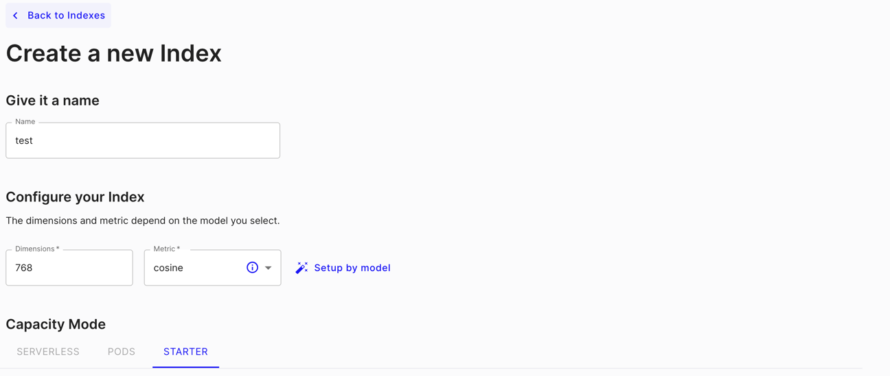
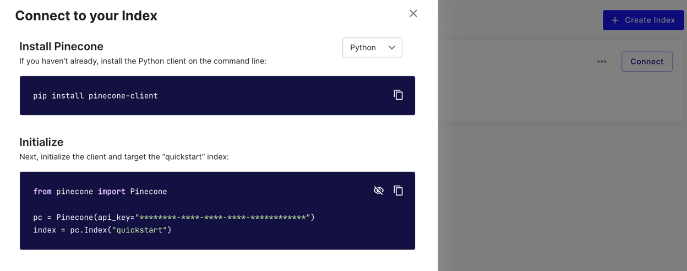

# README.md

## Summary

This project is a Python-based application that provides a command-line interface (CLI) for transcribing video files
into text and saving the transcriptions in a vector database. It uses the AssemblyAI API for transcribing and provides
functionalities for saving and searching transcriptions.

## Required Resources
1. Create a pinecone account -> https://www.pinecone.io/
   1. Create an index:
   2. Index config: 
   
   3. Get your API_KEY clicking on connect:
   
2. Create your AssemblyAi account -> https://www.assemblyai.com/
   1. Get you API_KEY in the home page.

## Installation

To install the project, follow these steps:  
Obs: The project was made with Python 3.9

1. Clone the repository:
    ```
    git clone https://github.com/mdalboni/video_transcriber.git
    ```
2. Navigate to the project directory:
    ```
    cd video_transcriber
    ```
3. Install the required Python packages using your virtual env:
    ```
    pip install -r requirements.txt
    ```
4. Set the required environment variables:
    ```
    export ASSEMBLY_AI_API_KEY=your_assembly_ai_api_key
    export PINECONE_API_KEY=your_pinecone_api_key
    ```

## Execution

To execute the project, you can use the following commands:

- To save transcriptions on the cloud:
    ```
    python main.py save -f <file_paths>
    ```
- To search for a vector from a file:
    ```
    python main.py search -f <file_path> -m <metadata> -k <top_k> -o <output_file>
    ```

Replace `<file_paths>`, `<file_path>`, `<metadata>`, `<top_k>`, and `<output_file>` with your actual values.


## Details and other information


### Topic Extractor
Topic extractor is doing all in one batch so if you upload multiple files they will get in the same topic extraction.  
I could fix this splitting the process for each file, but due to my lack of time and knowing this would increase the execution 
time by a ton for larger files groups I did not implement this change.


### I am not a ML Engineer
So I am not able to confirm if the vectors and metadata search are the best also I am not able to decide which vector 
size is more suitable for the experiment.
